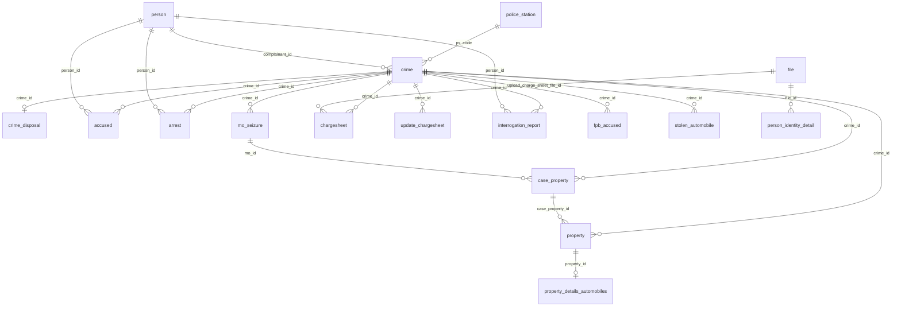

# CCTNS-V2 Database Schema

PostgreSQL relational schema derived from the [CCTNS-V2 Data Relay API](api-1.yaml) (OpenAPI 3.1). It models crime, person, property, chargesheet, interrogation, fingerprint bureau, and report data exposed by the relay endpoints.

## Contents

| File | Description |
|------|-------------|
| [api-1.yaml](api-1.yaml) | Source OpenAPI spec (read-only relay over CCTNS-v2) |
| [schema.sql](schema.sql) | Full DDL: tables, foreign keys, indexes, and views |

## Quick start

Create a database and apply the schema:

```bash
createdb cctns
psql -d cctns -v ON_ERROR_STOP=1 -f schema.sql
```

Verify:

```bash
psql -d cctns -c "\dt"
psql -d cctns -c "\dv"
```

## Schema summary

| Object type | Count |
|-------------|-------|
| Tables | 56 |
| Views | 2 |
| Foreign keys | 77 |
| FK indexes | 53 |

## Design conventions

- **IDs** — Source system uses MongoDB ObjectIds (24-char hex). Preserved as `VARCHAR(24)`.
- **Normalization** — 1:M arrays become child tables; scalar 1:1 nested objects are inlined with prefixes (`gd_*`, `occurrence_*`, `poo_*`, `pf_*`, `pw_*`, etc.).
- **Keys** — Fields marked `PRIMARY KEY` or `FOREIGN KEY` in the OpenAPI spec drive the relational key design.
- **Endpoint pairs** — List and `/{crimeId}` endpoints that share the same response schema map to a single table.
- **JSONB** — Nested arrays with undefined item schemas (`chargesheet.ACCUSED_PARTICULARS`, `ACTS_AND_SECTIONS`) are stored as `JSONB`.
- **Polymorphic property details** — `property-details` `ADDITIONAL_DETAILS` varies by `CATEGORY`; each category has its own 1:1 detail table.

## Entity clusters

### Master / core

| Table | PK | Source endpoint |
|-------|----|-----------------|
| `police_station` | `ps_code` | `master-data/hierarchy` |
| `file` | `file_id` | `files/{fileId}` |
| `person` | `person_id` | `person-details/{personId}` |
| `person_identity_detail` | `id` | (child of `person`) |
| `person_media` | `id` | (child of `person`) |

### Crime

| Table | PK | Key FKs |
|-------|----|---------|
| `crime` | `crime_id` | `ps_code` → `police_station`, `complainant_id` → `person` |
| `crime_disposal` | `crime_id` | `crime_id` → `crime` (1:1) |
| `accused` | `accused_id` | `crime_id`, `person_id` |
| `arrest` | `arrest_id` (surrogate) | `crime_id`, `person_id` |
| `mo_seizure` | `mo_seizure_id` | `crime_id` |

### Property

| Table | PK | Notes |
|-------|----|-------|
| `case_property` | `case_property_id` | FSL, court, custody, disposal |
| `case_property_media` | `id` | FK → `case_property`, `file` |
| `property` | `property_id` | Common fields + `category` |
| `property_media` | `id` | FK → `property` |
| `property_details_drugs` | `property_id` | CATEGORY = Drugs/Narcotics |
| `property_details_cultural` | `property_id` | CATEGORY = Cultural Property |
| `property_details_arms` | `property_id` | CATEGORY = Arms and Ammunition |
| `property_details_coins_currency` | `property_id` | CATEGORY = Coins and Currency |
| `property_details_automobiles` | `property_id` | CATEGORY = Automobiles |
| `property_details_explosives` | `property_id` | CATEGORY = Explosives |
| `property_details_jewellery` | `property_id` | CATEGORY = Jewellery |
| `property_details_misc` | `property_id` | CATEGORY = Miscellaneous |
| `property_details_documents` | `property_id` | CATEGORY = Documents and Valuable Securities |
| `property_details_electronics` | `property_id` | CATEGORY = Electrical and Electronic Goods |

### Chargesheet

| Table | PK | Key FKs |
|-------|----|---------|
| `chargesheet` | `charge_sheet_id` | `crime_id`, `upload_charge_sheet_file_id` → `file` |
| `chargesheet_accused_particular` | `id` | `charge_sheet_id`; payload in `JSONB` |
| `chargesheet_act_section` | `id` | `charge_sheet_id`; payload in `JSONB` |
| `update_chargesheet` | `update_charge_sheet_id` | `crime_id` |

### Interrogation report

| Table | PK | Notes |
|-------|----|-------|
| `interrogation_report` | `interrogation_report_id` | Inlines 1:1 objects; FK `crime_id`, `person_id` |
| `ir_associate_detail` | `id` | + 22 more `ir_*` child tables |
| `ir_consumer_detail` | `id` | |
| `ir_conviction_acquittal` | `id` | |
| `ir_defence_counsel` | `id` | |
| `ir_execution_nbw` | `id` | |
| `ir_family_history` | `id` | |
| `ir_financial_history` | `id` | |
| `ir_jail_sentence` | `id` | |
| `ir_local_contact` | `id` | |
| `ir_modus_operandi` | `id` | |
| `ir_new_gang_formation` | `id` | |
| `ir_pending_nbw` | `id` | |
| `ir_previous_offence_confessed` | `id` | |
| `ir_property_disposal` | `id` | |
| `ir_regularization_transit_warrant` | `id` | |
| `ir_shelter` | `id` | |
| `ir_sim_detail` | `id` | |
| `ir_surety` | `id` | |
| `ir_type_of_drug` | `id` | |
| `ir_indulgance_before_offence` | `id` | string array |
| `ir_interrogation_text` | `id` | string array |
| `ir_media` | `id` | string array |
| `ir_regular_habit` | `id` | string array |

### Fingerprint Bureau (FPB)

| Table | PK | Key FKs |
|-------|----|---------|
| `fpb_accused` | `fpb_accused_id` (surrogate) | `crime_id`, `person_id` |
| `fpb_additional_crime` | `id` | `fpb_accused_id` |

### Reports

| Object | PK | Source endpoint |
|--------|----|-----------------|
| `stolen_automobile` | `stolen_property_id` | `reports/stolen-automobiles` |
| `stolen_automobile_media` | `id` | (child of `stolen_automobile`) |
| `v_arrest_particulars` | (view) | `reports/arrest/arrest-particulars/v1` |
| `v_missing_udb_persons` | (view) | `reports/missing-udb-persons/v1` |

## Relationship overview



## Endpoint → table mapping

| API endpoint | Database object(s) |
|--------------|-------------------|
| `/api/{client}/master-data/hierarchy` | `police_station` |
| `/api/{client}/files/{fileId}` | `file` |
| `/api/{client}/person-details/{personId}` | `person`, `person_identity_detail`, `person_media` |
| `/api/{client}/crimes` | `crime` |
| `/api/{client}/crimes/disposal` | `crime_disposal` |
| `/api/{client}/accused` | `accused` |
| `/api/{client}/arrests` | `arrest` |
| `/api/{client}/mo-seizures` | `mo_seizure` |
| `/api/{client}/case-property` | `case_property`, `case_property_media` |
| `/api/{client}/property-details` | `property`, `property_media`, `property_details_*` |
| `/api/{client}/chargesheets` | `chargesheet`, `chargesheet_accused_particular`, `chargesheet_act_section` |
| `/api/{client}/update-chargesheets` | `update_chargesheet` |
| `/api/{client}/interrogation-reports/v1/` | `interrogation_report`, `ir_*` |
| `/api/{client}/fpb/accused` | `fpb_accused`, `fpb_additional_crime` |
| `/api/{client}/reports/stolen-automobiles` | `stolen_automobile`, `stolen_automobile_media` |
| `/api/{client}/reports/missing-udb-persons/v1/` | `v_missing_udb_persons` |
| `/api/{client}/reports/arrest/arrest-particulars/v1/` | `v_arrest_particulars` |

## Spec quirks handled in schema

- PascalCase fields normalized to snake_case (`SentenceStartDate` → `sentence_start_date`).
- Typo preserved in meaning only (`PURCHASE_AMOUN_IN_INR` → `purchase_amount_in_inr`).
- Lowercase `weight` in Jewellery category normalized to `weight`.
- Report views are best-effort joins over base tables; the relay flattens source data, so exact report semantics may differ from the upstream MongoDB queries.

## Requirements

- PostgreSQL 12+ (uses `JSONB`, standard `ALTER TABLE` FK syntax)
